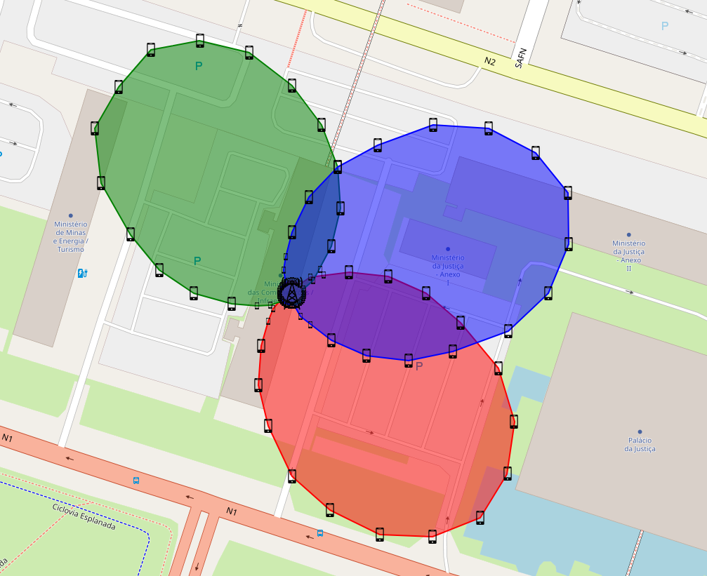

<h1 style="text-align: center;">Como executar o projeto</h2>

### Instalando as dependência
Para rodar o projeto, primeiro, é necessário instalar as bibliotecas necessárias. Para isso, siga os seguintes passos:
1. Clone o repositório para sua máquina local.
2. Crie e ative um ambiente virtual (opcional, mas recomendado):
   ```bash
   python -m venv env
   source env/bin/activate  # Para Linux/macOS
   .\env\Scripts\activate   # Para Windows
   ```
3. Instale as dependências com o comando:
   ```bash
   pip install -r requirements.txt
   ```
4. Após instalar as dependências, copie o arquivo `config.template.ini` e renomeie para `config.ini`, mantendo os caminhos fornecidos.

### Executando o projeto
1. Execute o código com o comando:
   ```bash
   python setup.py
   ```
   Resultando na seguinte saida:
   ```text
   Arquivos disponíveis:
   1. antenas_SE.csv
   2. antenas_DF.csv
   0. Usar configuração padrão
   Selecione o número do arquivo desejado (ou 0 para padrão):
   ```
2. Recebemos três opções após executar o `setup.py`: a primeira é `antenas_SE.csv`, a segunda é `antenas_DF.csv`, ou ainda a configuração padrão. Mais adiante, falaremos sobre os arquivos CSV. Para este caso, utilizaremos a opção zero.
   ```text
   Usar configuração padrão.
   Arquivos disponíveis:
   1. DF_Heights.tif
   2. SE_Heights.tif.
   0. Usar configuração padrão
   Selecione o número do arquivo desejado (ou 0 para padrão):
   ```
3. Após selecionar o primeiro arquivo, deve-se escolher o arquivo referente ao terreno. Lembre-se de que devemos sempre escolher os mesmos arquivos. Caso, no passo anterior, tenha sido selecionado `antenas_DF.csv`, agora deve-se escolher `DF_Heights.tif`. Para este caso, utilizaremos a opção zero.
   ```text
   484. 1013200486
   485. 1013249949
   486. 1013200923
   487. 1013200737
   488. 1014472110
   Escolha o índice do número da estação a ser analisada (ou 0 para padrão):
   ```
4. Após selecionar o arquivo referente ao terreno, uma lista com todas as antenas disponíveis será exibida. Essa lista é proveniente do arquivo CSV. Selecione uma antena qualquer ou a opção zero como padrão. Para este exemplo, utilizaremos a opção padrão.
   ```text
   Estação selecionada: 698607260
   Torre interferente 1
   Torre interferente 2
   Torre interferente 3
   Torre interferente 4
   Torre interferente 5
   Torre interferente 6
   Torre interferente 7
   Torre interferente 8
   Torre interferente 9
   SINR: -28.26 dB, SNR: -28.09 dB, Sinal: -115.09 dBm, Interferencia: -100.98 dBm, Ruido: -87.00 dBm, distancia: 5.00 m, Azimute Antena: 140°, Azimute Móvel: 0°, Elevação Antena: -5.0° Elevação Móvel: -82.5°, altura: 39.5 m, ganho: -30.67 dBm
   ```
5. Agora, é iniciado o processo de cálculo, no qual serão registrados todos os pontos com SINR menor ou igual a zero. Também recebemos um log com as informações sobre o número de antenas interferentes e os dados da antena em si.
   ```text
   KML salvo com sucesso!!!
   Mapa salvo com sucesso!!!
   Dados salvo com sucesso!!!
   ```
6. No final da execução, é informado que nossos dados foram salvos em um arquivo CSV na pasta `dados/mosaico/saida` e que um mapa foi salvo com nosso polígono na pasta `mapas/saida`.
<div style="text-align: center;">
    
</div>